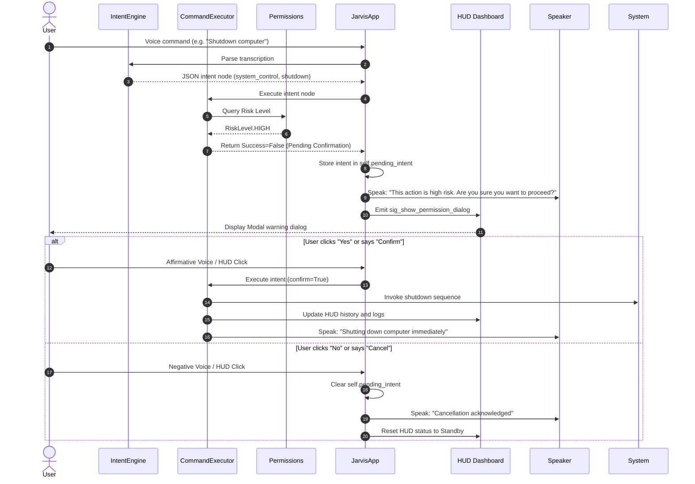

# JARVIS OS CONTROL LAYER ARCHITECTURE
## SYSTEM DATAFLOW & COMPONENT PIPELINE

This document details the architectural design and flow of the Jarvis OS Control Layer. It shows how speech commands pass from voice onset to native execution in Windows, while enforcing safety parameters.

---

## 1. Architectural Diagram

Below is the workflow showing the dataflow from Voice Input down to System Execution and Response:

```mermaid
graph TD
    A["Voice Input (User) / Double-Clap"] --> B["SpeechListener (VAD Module)"]
    B -->|WAV Audio File| C["SpeechTranscriber (Faster-Whisper)"]
    C -->|Raw Transcription Text| D["JarvisApp (Coordinator)"]
    
    D --> E{"IntentEngine (Intent Classifier)"}
    E -->|Conversation / Question| F["Gemini LLM Client"]
    E -->|OS Command Intent| G["CommandExecutor (Central routing)"]
    
    G --> H{"Permissions Module (Safety Gate)"}
    H -->|Shell Metacharacters Detected| I["Block Action & Raise Safety Error"]
    
    H -->|Risk = LOW / MEDIUM| J["Route to Native System Modules"]
    H -->|Risk = HIGH| K{"Confirmation Pending"}
    
    K -->|User Voice (Yes/Confirm) OR HUD UI Yes Click| J
    K -->|User Voice (Cancel) OR HUD UI No Click| L["Abort & Cancel Execution"]
    
    J --> M1["app_control.py"]
    J --> M2["window_control.py"]
    J --> M3["file_control.py"]
    J --> M4["system_control.py"]
    J --> M5["screenshot.py"]
    
    M1 & M2 & M3 & M4 & M5 --> N["ExecutionHistory (Lightweight volatile history)"]
    M1 & M2 & M3 & M4 & M5 --> O["Speaker (TTS audio playback)"]
    M1 & M2 & M3 & M4 & M5 --> P["HUD Dashboard (UI Event Updates)"]
    
    style A fill:#1a1a20,stroke:#00f0ff,stroke-width:2px,color:#fff
    style H fill:#331a1a,stroke:#ff1e50,stroke-width:2px,color:#fff
    style G fill:#1a2033,stroke:#0088cc,stroke-width:2px,color:#fff
    style J fill:#1a3320,stroke:#00ff66,stroke-width:2px,color:#fff
    style P fill:#2a1a33,stroke:#cc00ff,stroke-width:2px,color:#fff
```

---

## 2. Pipeline Stages & Execution Flow

### Stage 1: Audio Capture & Acoustic Monitoring
*   **SpeechListener**: Continuously listens to input streams. Uses Voice Activity Detection (VAD) to segment voice data.
*   **ClapDetector**: Operates alongside VAD; listens for double-claps to toggle the microphone privacy state.

### Stage 2: Local Audio Transcription
*   **SpeechTranscriber**: Employs a local Faster-Whisper instance (`tiny` / `base`) to transcribe segmented user WAV audio files into text.

### Stage 3: Routing Coordinator
*   **JarvisApp**: Acts as the central system coordinator. If the microphone is muted, it suppresses input processing. If active, it sends the transcription text to the classification engines.

### Stage 4: Intent Engine Parsing
*   **IntentEngine**: A rule-based parser that maps the transcription string to structured JSON nodes containing the intent, target, and arguments.

### Stage 5: Central Execution Engine
*   **CommandExecutor**: Receives the structured node. It is the single gateway to operating system modifications. No module is permitted to execute shell/API controls directly except through this class.

### Stage 6: Safety Permissions Validation
*   **Permissions Gate**: Intercepts the executor queue:
    1.  **Sanitization**: Scans strings for shell characters to prevent injection.
    2.  **Risk Appraisal**: Consults `INTENT_RISK_MAPPING` to assign a Risk Level (`LOW`, `MEDIUM`, `HIGH`).
    3.  **Confirmation Loop**: If risk level is `HIGH` (e.g. Shutdown/Restart/Sleep), it stalls execution, triggers a verbal prompt ("Are you sure?"), and opens a warning dialogue on the HUD.

### Stage 7: Native Module Invocation
Once safety parameters are met, the command is dispatched to the corresponding module:
*   **Application Control**: Interacts with the Windows Registry and process trees using `subprocess` and `psutil`.
*   **Window Management**: Manipulates UI positioning and focus via `pygetwindow`.
*   **File System**: Directs folder opening or runs shallow file searches using `os.startfile` and depth-limited `os.walk`.
*   **System Control**: Manages hardware volume via `pycaw` and calls native system functions (`ctypes.windll.user32.LockWorkStation`).
*   **Screenshot System**: Saves images using `pyautogui`.

### Stage 8: UI Updates & Speech Response
*   **Execution History Log**: Appends execution outcomes to the volatile record buffer.
*   **HUD Rendering**: Directs Qt Signals to update HUD elements (progress bars, status lights, history console, and last action text).
*   **Audio Response**: Triggers the Speaker to verbalize success/error responses to the user.

---

## 3. High-Risk Command Confirmation Sequence

The sequence chart below outlines the confirmation path followed during a `HIGH` risk action:


